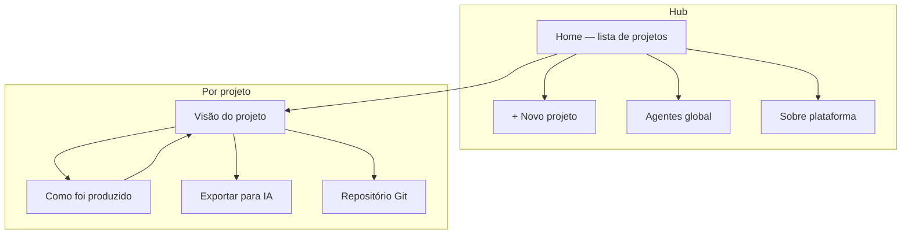
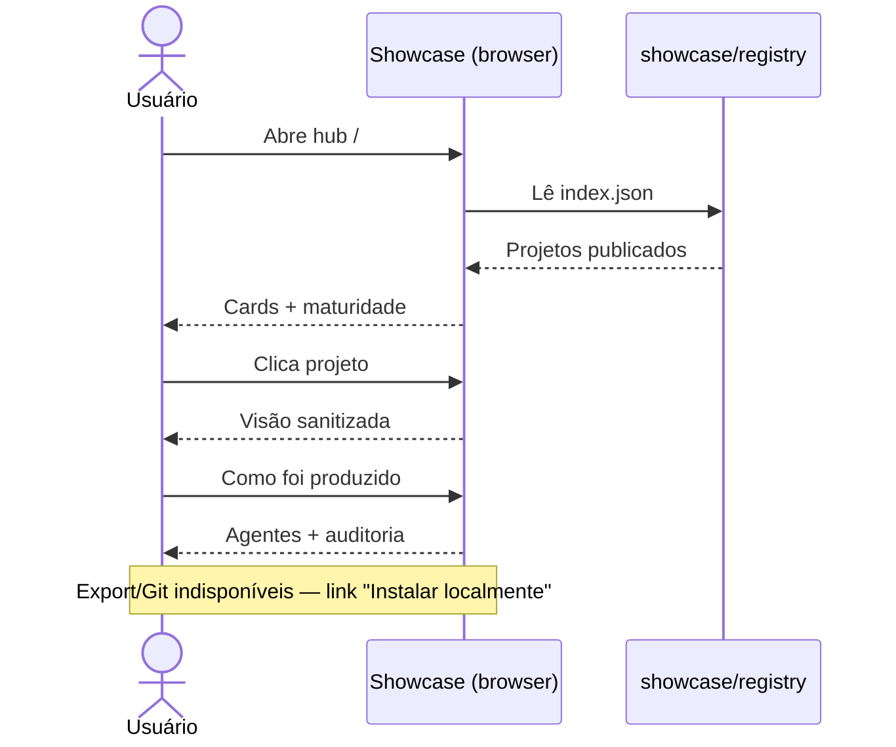
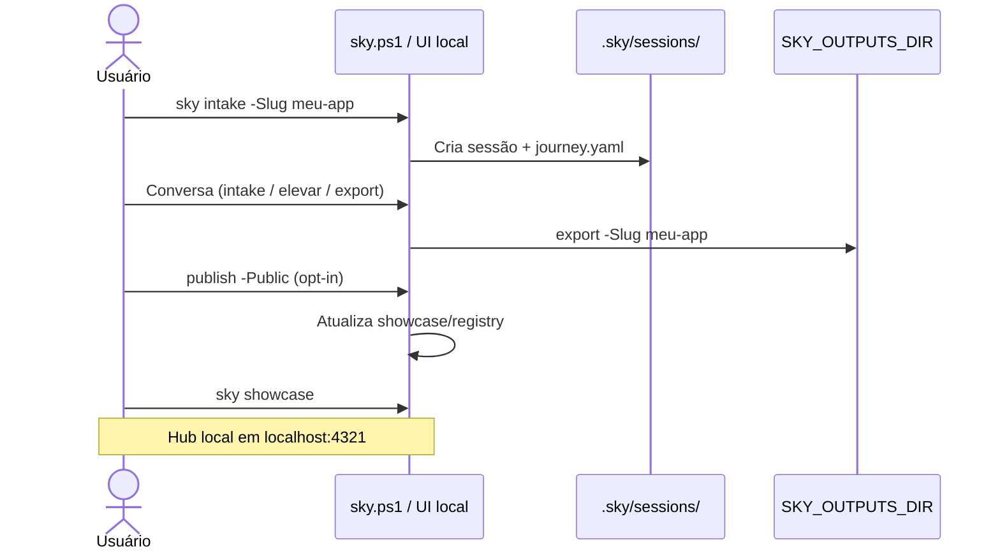
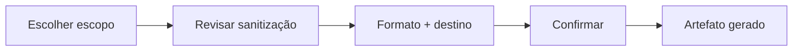

# Sky-Forge — Direção de UX do produto

**Versão**: 1.0 | **Data**: 2026-07-04  
**Relacionados**: [USER_JOURNEY.md](USER_JOURNEY.md) · [OUTPUTS_AND_SHOWCASE.md](OUTPUTS_AND_SHOWCASE.md) · [sky-host](../../.cursor/rules/sky-host.mdc)

Especificação concisa da experiência do **Sky-Forge como aplicativo**: hub de projetos, exportação para IA, conexão Git e plataforma técnica. Alinha-se aos princípios UXD — calmo, digno, baixa excitação, WCAG AA.

---

## Visão do produto

Sky-Forge é um **estúdio de elevação de ideias** que o usuário acessa:

| Modo | Quem | Onde roda |
|------|------|-----------|
| **Navegador** | Explorar showcase, retomar sessão leve, ver previews | `apps/showcase` (estático) → futuro PWA |
| **Instalação local** | Intake completo, export, Git, pacotes privados | CLI + UI local (`sky.ps1`, pasta `.sky/`) |

Ambos compartilham a mesma **linguagem visual** (tokens em `global.css`) e a mesma **arquitetura de informação**. O navegador mostra o que foi publicado; a instalação local opera o funil completo.

---

## Arquitetura de informação

```
Home (hub de projetos)
├── Lista de projetos (cards)
├── Ações globais: Novo projeto · Agentes · Sobre plataforma
│
├── /projects/{slug}/          → Saída do projeto (visão elevada)
│   ├── Resumo · SKY Score · maturidade · índices
│   ├── Roadmap e pipeline
│   └── CTAs: Exportar para IA · Conectar Git · Retomar no Cursor
│
├── /projects/{slug}/agentes/  → Como foi produzido (proveniência)
│   ├── Coreografia de agentes
│   ├── Gates humanos
│   └── Trilha de auditoria (sanitizada)
│
└── /sobre/                    → Sobre a plataforma
    ├── O que é Sky-Forge
    ├── Navegador vs instalação local
    ├── Camadas de dados (core · pacotes · previews)
    └── Privacidade por padrão
```

### Mapa de navegação (Mermaid)



### Hierarquia de conteúdo por tela

| Tela | Primário | Secundário | Nunca na mesma ação |
|------|----------|------------|---------------------|
| Home | Lista + estado | Link Sobre | Export + publish juntos |
| Projeto | Maturidade + próximo passo | Índices SKY | Brief completo sensível |
| Como foi produzido | Agentes + gates | Eventos recentes | Paths absolutos |
| Sobre | Modos de uso | Diagrama técnico | Urgência / upsell |
| Exportar | Escolher formato | Destino pasta | Publicar showcase |

---

## Princípios visuais e de interação

1. **Uma decisão por vez** — máximo 4 opções numeradas (sky-host).
2. **Progresso sempre visível** — barra de maturidade + fase humana.
3. **Privacidade por padrão** — projetos locais não aparecem no hub até opt-in.
4. **Tom calmo** — sem contadores animados, badges piscantes ou copy de urgência.
5. **Tipografia digna** — Cormorant (títulos) + Mulish (corpo); contraste AA.
6. **Espaço respirável** — cards com sombra suave; gradiente sky apenas no header.

Tokens existentes (`--color-sky-deep`, `--color-surface`, etc.) são a base; evitar novos acentos saturados.

---

## Fluxo: navegador vs instalação local

### Navegador (showcase / futuro PWA)



**Comportamento:**

- Hub read-only; dados de `showcase/registry/` (previews com `-Public`).
- Empty state orienta instalação local, não pressiona publish.
- Footer/header: link **Sobre** explica limitações do modo browser.
- Futuro PWA: cache offline dos previews já publicados.

### Instalação local (CLI + UI nativa / Electron futuro)



**Comportamento:**

- `.sky/sessions/{slug}/` é fonte de verdade durante intake.
- Pacote completo em `SKY_OUTPUTS_DIR/{slug}/` (fora do repo por padrão).
- Hub local pode ler `data_source: outputs` em dev (`sky.config.yaml`).
- sky-host guia cada passo; comandos só após explicação humana.

### Tabela comparativa

| Capacidade | Navegador | Local |
|------------|-----------|-------|
| Ver projetos publicados | Sim | Sim (+ privados) |
| Intake conversacional | Não (futuro: API) | Sim |
| Export pacote completo | Não | Sim |
| Export para IA (subset) | Download JSON sanitizado | Sim, pasta escolhida |
| Conectar Git | Não | Sim |
| Publish -Public | Não | Sim |

---

## Registro e listagem de projetos

### Registrar novo projeto

**Gatilho:** botão/link discreto "+ Novo projeto" no hub (local) ou comando `sky intake -Slug <slug>`.

**Fluxo (3 passos, uma pergunta por tela):**

1. **Nome e slug** — título humano; slug derivado (editável); validação de colisão.
2. **Contexto inicial** — textarea livre ("Descreva a ideia em suas palavras") OU importar zip/brownfield (opcional).
3. **Privacidade** — "Manter só nesta máquina" (default) vs "Permitir preview público depois" (não publica ainda).

**Persistência:**

- Sessão: `.sky/sessions/{slug}/journey.yaml` + `maturity.yaml`
- Hub local: entrada em índice derivado de sessões ativas + registry publicado

### Listagem (hub)

**Card de projeto** (já implementado em `ProjectCard.astro`):

| Elemento | Fonte | Notas |
|----------|-------|-------|
| Título + excerpt | `index.json` / sessão | Máx. 2 linhas |
| Tier / elevação | preview | chips discretos |
| SKY Score | preview | pill, não animado |
| Maturidade % | preview | barra opcional na página detalhe |
| Ação | "Ver visão completa →" | link único primário |

**Estados vazios:**

- Zero projetos: ilustração mínima + "Comece descrevendo uma ideia" + comando exemplo (secundário).
- Projetos só locais (dev): badge "Privado" no card; não aparecem em deploy público.

**Ordenação:** `updated_at` desc; filtro futuro por fase (shape / deliver / …).

---

## Fluxo: exportar para IA

Objetivo: entregar **contexto estruturado** para Cursor, Claude, ChatGPT ou pipeline CI — sem vazar segredos.

### Momentos de entrada

- Fase **Entregar** (delivery-steward): export completo ou parcial.
- Página do projeto: CTA secundário **"Exportar para IA"** (nunca junto com publish).

### Passos UX



1. **Escopo** (radio, uma escolha):
   - *Essencial* — brief resumido, RFs top, índices SKY, ux-spec tokens
   - *Especificação* — + arquitetura, ADRs, maturidade completa
   - *Pacote completo* — tudo em `outputs/` (requer validação sensibilidade)

2. **Sanitização** — checklist explícita:
   - Remover paths absolutos
   - Omitir `.dc.html` proprietários (referência only)
   - Confirmar: "Há dados de clientes?" → se sim, bloquear escopo completo

3. **Formato**:
   - `SKY_AI_CONTEXT.md` — markdown único concatenado (default)
   - `sky-ai-bundle.zip` — YAMLs + manifest
   - `cursor-rules/` — snippets `.mdc` derivados de ux-spec

4. **Destino**:
   - Copiar para clipboard (escopos pequenos)
   - Salvar em `{SKY_OUTPUTS_DIR}/{slug}/ai-export/`
   - Abrir pasta no explorador

5. **Confirmação calma** — "Pacote pronto em …" + 2 opções: "Conectar Git" ou "Voltar ao projeto".

### Conteúdo do bundle (referência)

| Artefato | Essencial | Especificação | Completo |
|----------|-----------|---------------|----------|
| brief-draft (resumo) | ✓ | ✓ | ✓ |
| sky-merits.yaml | ✓ | ✓ | ✓ |
| ux-spec.yaml (tokens) | ✓ | ✓ | ✓ |
| functional-requirements | top 10 | ✓ | ✓ |
| architecture / ADRs | — | ✓ | ✓ |
| cloud-design refs | — | ref | ✓ |
| prompts assembled | — | — | ✓ |

Comando CLI: `sky export -Slug x -ForAI -Scope essential|spec|full` gera
`SKY_AI_CONTEXT.md` sanitizado em `{outputs}/{slug}/ai-export/`; o wizard visual
sobre esse CLI é a fase C ([ROADMAP.md](ROADMAP.md)).

---

## Conexão Git por projeto

Explorar repositório Git **por projeto** para: versionar specs, sincronizar scaffold, CI de validação.

### Opção A — Pasta local (detecção automática)

Usuário aponta diretório; app detecta `.git/` e remote existente.

| Prós | Contras |
|------|---------|
| Alinha com SKY_OUTPUTS_DIR e privacidade | Inútil no modo browser |
| Zero credenciais na UI | Remote opcional confunde alguns usuários |
| Funciona offline | |

### Opção B — URL + Personal Access Token

Formulário: URL do remote + PAT (GitHub/GitLab) armazenado no keychain OS.

| Prós | Contras |
|------|---------|
| Push/pull explícito | PAT assusta não-desenvolvedores |
| Funciona com qualquer host | Segredo local ainda é responsabilidade do usuário |
| Previsível para CI | Rotação manual de token |

### Opção C — OAuth app (GitHub/GitLab)

Botão "Conectar conta" → OAuth → picker de repo da conta.

| Prós | Contras |
|------|---------|
| Melhor UX para devs | Exige backend / app OAuth registrado |
| Sem colar token | Conflita com privacidade-by-default |
| Repo picker familiar | Complexo para MVP |

### Recomendação: **A + extensão opcional B** ("Local-first, remote quando quiser")

**Rationale:**

- Coerente com [OUTPUTS_AND_SHOWCASE.md](OUTPUTS_AND_SHOWCASE.md): pacotes fora do repo, opt-in explícito.
- MVP local não precisa OAuth nem backend.
- Usuários avançados expandem com PAT na aba "Remoto" — mesma tela, não wizard separado.

### Wireframe: tela Repositório (por projeto)

```
┌─────────────────────────────────────────────────────────┐
│  ← Voltar ao projeto          Repositório Git           │
├─────────────────────────────────────────────────────────┤
│  Status: ○ Não conectado                                │
│                                                         │
│  ┌─ Pasta de trabalho ─────────────────────────────┐   │
│  │  C:\Users\...\sky-projects\meu-app               │   │
│  │  [ Escolher pasta… ]                             │   │
│  │  ✓ Repositório Git detectado · branch main       │   │
│  └──────────────────────────────────────────────────┘   │
│                                                         │
│  ▼ Remoto (opcional)                                    │
│  ┌──────────────────────────────────────────────────┐   │
│  │  https://github.com/org/meu-app                   │   │
│  │  Token: ••••••••••  [ Gerenciar no sistema ]      │   │
│  │  [ Testar conexão ]                               │   │
│  └──────────────────────────────────────────────────┘   │
│                                                         │
│  Sincronização                                          │
│  ○ Manual — export gera commit sugerido                 │
│  ○ Após export — commit automático (mensagem padrão)    │
│                                                         │
│  [ Salvar ]                    [ Desconectar ]          │
└─────────────────────────────────────────────────────────┘
```

**Regras UX:**

- Nunca pedir PAT na chegada; só ao expandir "Remoto".
- Mensagens de erro humanas ("Não encontramos .git nesta pasta").
- Browser: substituir por card "Disponível na instalação local" + link Sobre.

**Persistência proposta:** `.sky/sessions/{slug}/git.yaml`:

```yaml
workspace_path: null  # ou absoluto
remote_url: null
sync_mode: manual  # manual | after_export
credential_ref: null  # keychain id, nunca plaintext no yaml
```

---

## Wireframes textuais — telas-chave

### 1. Home — Hub de projetos

```
┌──────────────────────────────────────────────────────────┐
│ [gradient header]                                        │
│  Sky-Forge · Hub de projetos                             │
│  Seus projetos elevados — visão clara, passo a passo.    │
│                                                          │
│  [ Projetos ]  Agentes   Sobre                           │
├──────────────────────────────────────────────────────────┤
│  + Novo projeto                                          │
│                                                          │
│  ┌─────────────┐  ┌─────────────┐  ┌─────────────┐      │
│  │ iautos      │  │ horta       │  │ …           │      │
│  │ SKY 78      │  │ Privado     │  │             │      │
│  │ Maturidade  │  │ 42%         │  │             │      │
│  │ Ver →       │  │ Retomar →   │  │             │      │
│  └─────────────┘  └─────────────┘  └─────────────┘      │
└──────────────────────────────────────────────────────────┘
```

### 2. Visão do projeto (`/projects/{slug}/`)

```
Header: título · badge fase · maturidade global
Tabs: Visão | Como foi produzido

[ Painel SKY Score + 5 índices em barras ]
[ Roadmap fases — dots calmos ]
[ Pipeline gates ]

CTAs (vertical, numerados):
  1) Retomar conversa no Cursor
  2) Exportar para IA
  3) Configurar repositório
```

### 3. Como foi produzido (`/projects/{slug}/agentes/`)

```
Teaser: "Este pacote passou por N agentes · última ação há X"

[ Roster de agentes + nível autonomia ]
[ Gates: brief ✓ · elevation ✓ · package ○ ]
[ Tabela eventos — 30 recentes, outcome ok/blocked ]
```

### 4. Sobre a plataforma (`/sobre/`)

Ver implementação em `apps/showcase/src/pages/sobre.astro`. Seções: missão, dois modos, diagrama de camadas, privacidade, links docs.

### 5. Exportar para IA (modal ou página dedicada)

```
Escopo: ( ) Essencial  ( ) Especificação  ( ) Completo

☑ Remover paths absolutos
☑ Omitir templates proprietários
☐ Incluir prompts avançados

Formato: [ SKY_AI_CONTEXT.md ▼ ]
Destino:  [ Pasta do projeto ▼ ]

[ Gerar export ]     Cancelar
```

---

## Integração com agentes existentes

| Agente | Responsabilidade UX |
|--------|---------------------|
| sky-host | Hub mental; roteia para intake / export / showcase |
| intake-conductor | Registro + shape; atualiza cards indiretamente |
| delivery-steward | Export + pasta externa; gate sensibilidade |
| showcase-curator | Publish -Public; alimenta hub browser |
| repo-scaffolder | Pós-export; link com Git workspace |

Atualizar `journey.yaml` ao mudar fase; hub reflete `journey_phase` nos snapshots de agentes.

---

## Métricas de sucesso (UX)

- Tempo até primeiro card no hub após intake < 1 sessão
- Zero publicações acidentais (100% opt-in confirmado)
- Export IA usado sem incidente de vazamento (checklist completado)
- SUS alvo ≥ 80 no fluxo registro → export (piloto)

---

## Roadmap de implementação UI

| Fase | Entrega |
|------|---------|
| **A** (atual) | Showcase estático: hub, sobre, agentes; spec este doc |
| **B** | Hub local lê sessões + outputs; badge Privado |
| **C** | Wizard export-for-AI + `git.yaml` |
| **D** | PWA read-only; OAuth remoto (opcional) |

---

## Referências de implementação

- Tokens e layout: `apps/showcase/src/styles/global.css`
- Hub: `apps/showcase/src/pages/index.astro`
- Plataforma: `apps/showcase/src/pages/sobre.astro`
- Config paths: `sky.config.yaml`
- Jornada conversacional: `docs/_meta/USER_JOURNEY.md`
