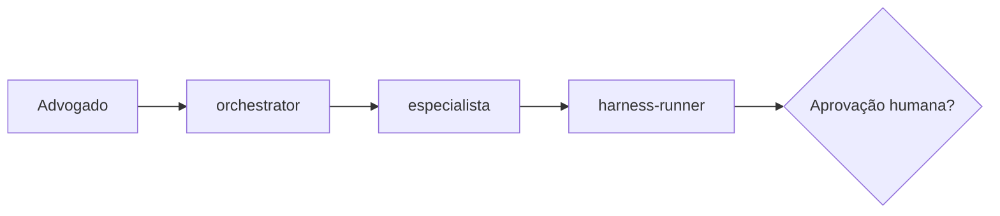

# Arquitetura agêntica · {ProjectTitle}

**Padrão:** Arah (manifests + coreografia + harness spec-driven)  
**Slug:** {slug} · `ai_suggested: true` até revisão humana

## Por que agentes aqui

{1–2 frases ligando RFs de IA/copiloto aos containers C4 Agent/Copilot.}

## Mapeamento C4 → agentes

| Container C4 | Agentes da solução |
|--------------|-------------------|
| {container} | {agent-id} |

## Roster MVP

| ID | Tipo | Função | RF |
|----|------|--------|-----|
| orchestrator | operational | Roteamento de tarefas | RF-xxx |

## Fluxo típico

## Artefatos

- `agents/` — manifests e coreografia
- `agent-graph.md` — grafo completo
- `specs/agent-harness.spec.yaml` — aceite verificável

## Gates HITL

Toda saída que altera pasta do caso passa por aprovação humana antes de publicar.
